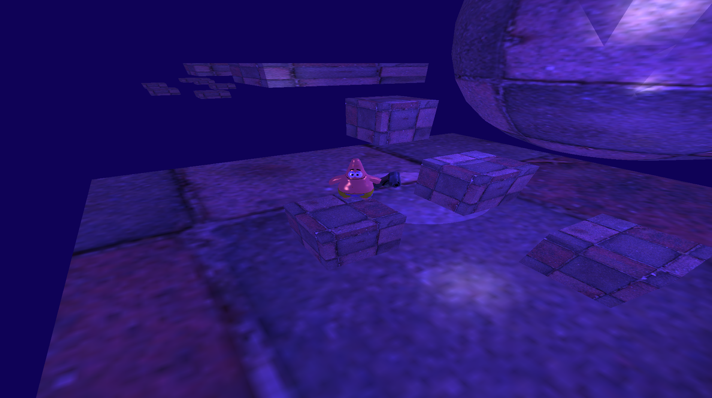
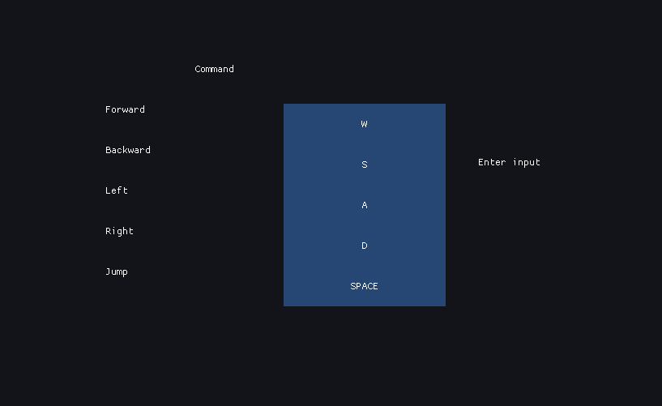

# Project PlatformerGL
<hr />

**Authors : Bryan Bachelet, Vincent Devine**

**Version :** Beta. 

For ISART Digital

<hr /><br />

## **Project description :**
Our goal of the project is to develop a platformer by your own means using all the knowledge and experience gained during the year.<br />
We have as a constraint that we must use your own math, collision librairy, and take over the base of our previous project (ModernOpenGL).<br />
For this project, we have 2 weeks.

## **Skills evaluate :**
Math & Algorithm : Algorithms for calculating of intersections and 3D collsisions<br />
Math & Algorithm : Space and primitives geometrical<br />

## **To build and run the project :** 
Open the project in Visual Studio and start this (F5).
<br /><hr />


## **Commands :**
- W/S : Move forward/backward
- A/D : Move left/right
- Space : Jump
- Mouse : Look in a direction 
- Right click : Lock mouse in window
- ESC : Return to menu
- F1 : Show editor/collider
<br /><hr />

## **Setting :**
- You can change the player's controls
- To change the controls, you need to click on the input you want to change and click on the new input (on your keyboard)


<br /><hr />

## **Camera :**
- Turn around the player
- The forward of the player is the forward of the camera (like a classical third person game)
<br /><hr />

## **Collider :**
- Represented only the form
- 2 types of colliders : Parallelogram and Sphere
- The player was represented by a sphere
<br /><hr />

## **Rigibody :**
- Represented the forced apply on your GameObject (move, jump, collision, gravity)
- Contains a velocity
- Rigidbody has the option to be kinematic
- You can deactivate the gravity application for each rigidbody
<br /><hr />

## **Collision :**
- Differents types of collisions:
    - Sphere - Sphere
    - Box - Sphere
    - Box - Box    
<br /><hr />

##  **Feature to add**
- Glide with inclined platforms
<br /><hr />

## **Architecture**
```sh.
│   .gitattributes
│   .gitignore
│   OpenGL.sln
│   README.md
│
├───OpenGL
│   │   imgui.ini
│   │   Log.txt
│   │   OpenGL.vcxproj
│   │   OpenGL.vcxproj.filters
│   │   OpenGL.vcxproj.user
│   │
│   ├───DLL
│   ├───Headers
│   │   │   App.hpp
│   │   │   Assertion.hpp
│   │   │   Camera.hpp
│   │   │   Collider.hpp
│   │   │   Collision.hpp
│   │   │   Credit.hpp
│   │   │   GameObject.hpp
│   │   │   Graph.hpp
│   │   │   IComponent.hpp
│   │   │   InputsManager.hpp
│   │   │   IResource.hpp
│   │   │   Light.hpp
│   │   │   LightManager.hpp
│   │   │   Log.hpp
│   │   │   Menu.hpp
│   │   │   Mesh.hpp
│   │   │   Model.hpp
│   │   │   MyMaths.hpp
│   │   │   OBJParser.hpp
│   │   │   PhysicManager.hpp
│   │   │   PhysicsManager.inl
│   │   │   PlayerControler.hpp
│   │   │   Renderer.hpp
│   │   │   ResourcesManager.hpp
│   │   │   Rigidbody.hpp
│   │   │   Scene.hpp
│   │   │   Setting.hpp
│   │   │   Shader.hpp
│   │   │   TestMyMaths.hpp
│   │   │   Texture.hpp
│   │   │   Timer.hpp
│   │   │   Transform.hpp
│   │   │
│   │   └───Imgui
│   │
│   ├───Includes
│   │   ├───glad
│   │   ├───GLFW
│   │   ├───KHR
│   │   └───STB_Image
│   │
│   ├───Libs
│   │
│   ├───Resources
│   │   ├───Obj
│   │   │       cube.obj
│   │   │       c_pistol.obj
│   │   │       frying_pan.obj
│   │   │       patrick.obj
│   │   │       quad.obj
│   │   │       skipper.obj
│   │   │       Slime.obj
│   │   │
│   │   ├───Shaders
│   │   │       ColliderFrag.frag
│   │   │       FragmentShaderSource.frag
│   │   │       VertexShaderSource.vert
│   │   │
│   │   └───Textures
│   │           c_pistol.png
│   │           frying_pan.png
│   │           Patrick.png
│   │           sample.png
│   │           sample2.png
│   │           skipper.png
│   │           Slime.png
│   │           wall.jpg
│   │
│   ├───Screenshots
│   │
│   ├───Sources
│   │   │   App.cpp
│   │   │   Camera.cpp
│   │   │   Collider.cpp
│   │   │   Collision.cpp
│   │   │   Credit.cpp
│   │   │   GameObject.cpp
│   │   │   glad.c
│   │   │   Graph.cpp
│   │   │   InputsManager.cpp
│   │   │   InterfaceEditor.cpp
│   │   │   InterfaceEditor.hpp
│   │   │   Light.cpp
│   │   │   LightManager.cpp
│   │   │   Log.cpp
│   │   │   main.cpp
│   │   │   Menu.cpp
│   │   │   Mesh.cpp
│   │   │   Model.cpp
│   │   │   MyMaths.cpp
│   │   │   PhysicsManager.cpp
│   │   │   PlayerControler.cpp
│   │   │   Renderer.cpp
│   │   │   ResourcesManager.cpp
│   │   │   Rigidbody.cpp
│   │   │   Scene.cpp
│   │   │   Setting.cpp
│   │   │   Shader.cpp
│   │   │   TestMyMaths.cpp
│   │   │   Texture.cpp
│   │   │   Timer.cpp
│   │   │   Transform.cpp
│   │   │
│   │   └───Imgui
│   └───stb-master
``` 

<br /><hr />
Code editor : Visual Studio Community <br />
System : Windows